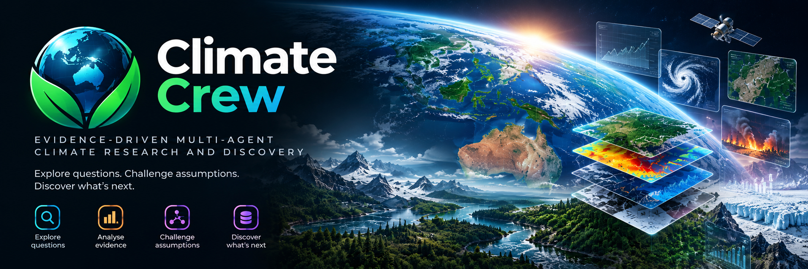
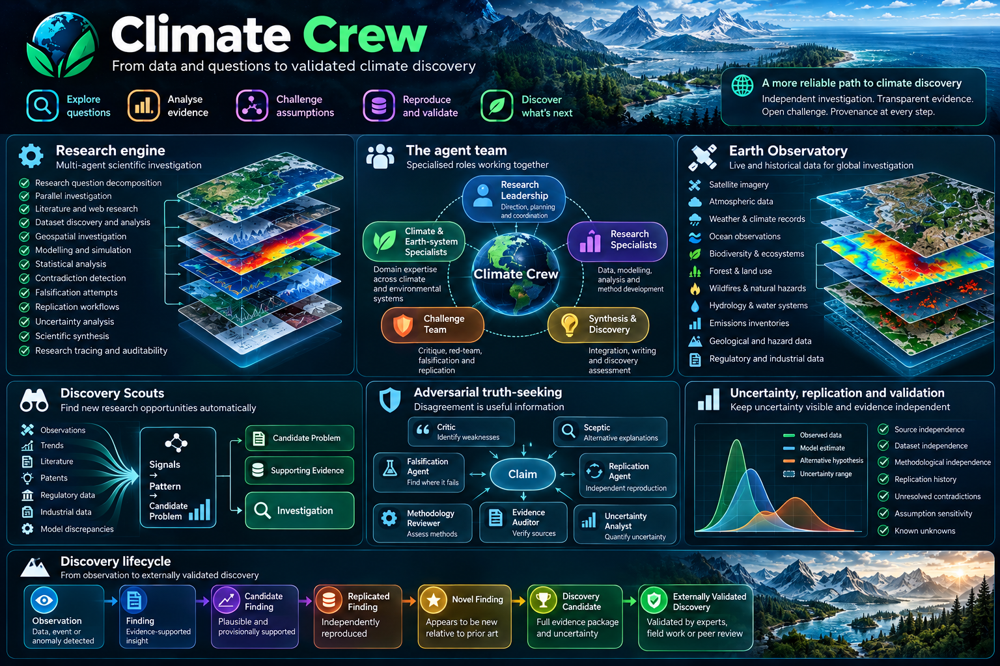
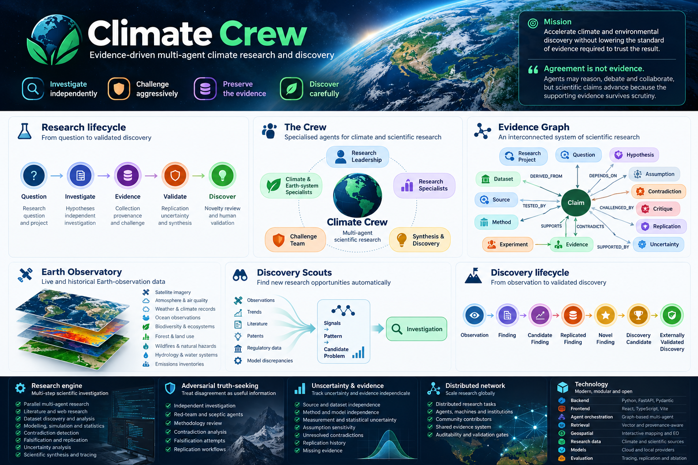

# 🌍 Climate Crew

## Evidence-driven multi-agent climate research and discovery

<p align="center">
  
</p>

Climate Crew is a multi-agent scientific research platform for investigating climate, environmental and Earth-system problems. It coordinates specialised research agents, observational data, scientific literature, datasets, models, simulations and human expertise through a provenance-aware process designed to produce findings that can be challenged, reproduced and validated.

> **Mission:** accelerate climate and environmental discovery without lowering the standard of evidence required to trust the result.

**Agreement is not evidence.** Agents may reason, debate and collaborate, but scientific claims advance because their supporting evidence survives scrutiny.

<p align="center">
  
</p>

---

## 🔬 Research lifecycle

```text
Research Question
      ↓
Research Project
      ↓
Problem Decomposition
      ↓
Competing Hypotheses
      ↓
Independent Investigation
      ↓
Evidence Collection + Provenance
      ↓
Cross-Agent Challenge
      ↓
Falsification Attempts
      ↓
Replication
      ↓
Uncertainty Analysis
      ↓
Scientific Synthesis
      ↓
Finding
      ↓
Novelty / Prior-Art Review
      ↓
Discovery Candidate
      ↓
Human / Expert Validation
```

The durable unit of work is a **Research Project**, not a chat answer. Projects preserve questions, hypotheses, claims, evidence, sources, datasets, observations, methods, models, assumptions, contradictions, replications, uncertainty and research history.

---

## 🧠 Scientific principles

- **Evidence before consensus** — agent agreement does not make a claim true.
- **Independent investigation** — important questions can be examined through separate agents, methods and data sources before synthesis.
- **Memory is not evidence** — remembered context supports continuity; scientific claims require attributable evidence.
- **Contradictions remain visible** — conflicting evidence is preserved and investigated rather than silently averaged away.
- **Findings must survive challenge** — criticism, red-team analysis, falsification and replication are part of the research process.
- **Provenance survives the pipeline** — outputs remain traceable to sources, transformations, datasets, models, methods and assumptions.
- **Uncertainty stays visible** — observed, inferred, modelled, simulated, estimated, disputed and unknown states remain distinguishable.
- **Humans remain part of validation** — an agent or agent majority cannot declare scientific truth.

---

## 👥 The Crew

Climate Crew organises specialised intelligence into complementary scientific roles.

### Research leadership
**Research Director · Strategic Planner · Research Coordinator**

### Climate & Earth-system specialists
Climate anomalies and attribution, atmosphere and air quality, greenhouse gases and carbon, oceans, biodiversity, ecology, forests, land-use change, wildfire, floods, natural hazards, geospatial and satellite intelligence, water and soil systems, environmental chemistry, cryosphere science, energy systems, climate finance, ESG, regulation and climate-relevant technologies.

### Research specialists
**Literature Researcher · Dataset Researcher · Observational Data Researcher · Modelling Agent · Statistical Analyst · Experimental Designer · Geospatial Researcher · Novelty / Prior-Art Researcher**

### Challenge team
**Critic · Sceptic / Red-Team Researcher · Falsification Agent · Replication Agent · Uncertainty Analyst · Evidence Auditor · Methodology Reviewer**

### Synthesis & discovery
**Research Synthesizer · Scientific Writer · Discovery Assessor**

Agents can form temporary research teams around a problem rather than forcing every investigation through one fixed workflow.

---

## 🕸️ Evidence Graph

Climate Crew represents research as an interconnected evidence system.

```text
ResearchProject   ResearchQuestion   Hypothesis   Claim
Evidence          Source             Dataset      Observation
Method            Experiment         Model        Assumption
Contradiction     Critique           Replication  Uncertainty
Finding           DiscoveryCandidate
```

Relationships can include:

```text
Evidence ──SUPPORTS──────▶ Claim
Evidence ──CONTRADICTS───▶ Claim
Claim ─────DERIVED_FROM──▶ Dataset
Claim ─────DEPENDS_ON────▶ Assumption
Claim ─────TESTED_BY─────▶ Experiment
Claim ─────CHALLENGED_BY─▶ Critique
Claim ─────REPLICATED_BY─▶ Replication
Finding ───SUPPORTED_BY──▶ Evidence
```

Evidence records distinguish observational, experimental, published, derived, modelled, simulated, estimated and synthetic information.

---

## 🌐 Earth Observatory

The Earth Observatory connects research reasoning to live and historical environmental data, including satellite imagery, atmospheric observations, weather and climate records, ocean observations, emissions inventories, air quality, biodiversity, forest and land-use monitoring, wildfire, hydrology, floods, geological hazards, environmental monitoring and regulatory or industrial information.

Geospatial investigations can connect locations, observations, events, datasets and claims through the same evidence architecture.

---

## 🔭 Discovery Scouts

Discovery Scouts search for emerging research opportunities across independent environmental and scientific signals: observations, unexplained trends, literature, patents, regulatory data, industrial information, waste streams and discrepancies between models and observations.

```text
Signals → Pattern → Candidate Problem → Supporting Evidence → Investigation
```

The platform can therefore search for problems worth investigating instead of only waiting for people to define them.

---

## 🧪 Research engine

Capabilities include research-question decomposition, parallel investigation, literature and web research, dataset discovery and analysis, provenance-aware retrieval, geospatial investigation, competing-hypothesis analysis, structured scientific debate, modelling, simulation, statistical analysis, contradiction detection, falsification, replication, uncertainty analysis, synthesis, novelty review and research tracing.

The goal is not to maximise agent count. Climate Crew should select the smallest useful combination of genuinely complementary and independent capabilities for each problem.

<p align="center">
  
</p>

---

## ⚖️ Adversarial truth-seeking

Claims can be exposed to adversarial evaluation that searches for contradictory observations, methodological weaknesses, unsupported assumptions, alternative explanations, statistical errors, data leakage, correlated sources, model dependence, irreproducible calculations and prior research that undermines novelty.

Prediction and forecasting mechanisms can record explicit expectations about measurable future outcomes. Their resolution can inform method reliability, but does not replace scientific evidence about the underlying claim.

---

## 🔁 Replication, falsification & uncertainty

Climate Crew separates **producing a result** from **trusting a result**. Significant claims can be reconstructed using different agents, models, datasets, statistical methods, assumptions, searches, calculations and simulations.

Assessment can consider source, dataset, methodological and model independence; measurement and statistical uncertainty; assumption sensitivity; unresolved contradictions; replication history; and missing evidence.

Ten articles derived from one dataset should not automatically count as ten independent confirmations.

---

## 🔎 Discovery lifecycle

```text
Observation
   ↓
Finding
   ↓
Candidate Finding
   ↓
Replicated Finding
   ↓
Novel Finding
   ↓
Discovery Candidate
   ↓
Externally Validated Discovery
```

A **Discovery Candidate** contains the evidence, provenance, methods, contradictions, uncertainty, replication history and novelty assessment required for external evaluation. Validation may require experts, independent datasets, field investigation, laboratory work or peer review.

---

## 🌎 Distributed Climate Discovery Network

Large investigations can be decomposed into bounded research tasks and distributed across agents, machines, institutions or community contributors. Returned work enters the same evidence and provenance system and remains subject to validation gates.

Examples include reproducing calculations, analysing datasets, testing parameter regions, sensitivity analysis, comparing models, searching for contradictory evidence, investigating prior art and examining geographic anomalies.

---

## 🧬 Research memory & integrity

Research memory preserves previous questions, hypotheses, rejected explanations, evidence, contradictions, datasets, methods, model outputs, replication attempts, uncertainty assessments and findings without confusing remembered information with verified evidence.

Research records can preserve source attribution, timestamps, dataset identity, transformations, model and tool involvement, assumptions, agent contributions, critiques, contradictions, replication results and human validation decisions.

Synthetic, fallback, demonstration and simulated information must remain distinguishable from observational evidence throughout the pipeline.

---

## 🏗️ Technology

| Layer | Technology direction |
|---|---|
| Backend | Python, FastAPI, Pydantic |
| Agent orchestration | Graph and project-native multi-agent orchestration |
| Retrieval | Vector and provenance-aware research retrieval |
| Frontend | React, TypeScript, Vite |
| Geospatial | Interactive Earth observation and mapping |
| Research data | Climate, environmental, scientific and Earth-observation sources |
| Models | Configurable cloud and local model providers |
| Evaluation | Research tracing, judging, replication and ablation |

Individual model providers and data services are integrations rather than permanent architectural dependencies.

---

## ⚡ Development setup

```bash
git clone https://github.com/Masterleeaus/Climate-crew.git
cd Climate-crew
python -m venv venv
source venv/bin/activate  # Windows: venv\Scripts\activate
pip install -r requirements.txt
uvicorn main:app --reload
```

Frontend:

```bash
cd frontend
npm install
npm run dev
```

FastAPI development docs are normally available at `http://localhost:8000/docs`; Vite normally runs at `http://localhost:5173`.

Credentials required by external models or data providers should be supplied through environment configuration rather than committed to source control.

---

## 🌍 Climate Crew

**Investigate independently. Challenge aggressively. Preserve the evidence. Discover carefully.**
