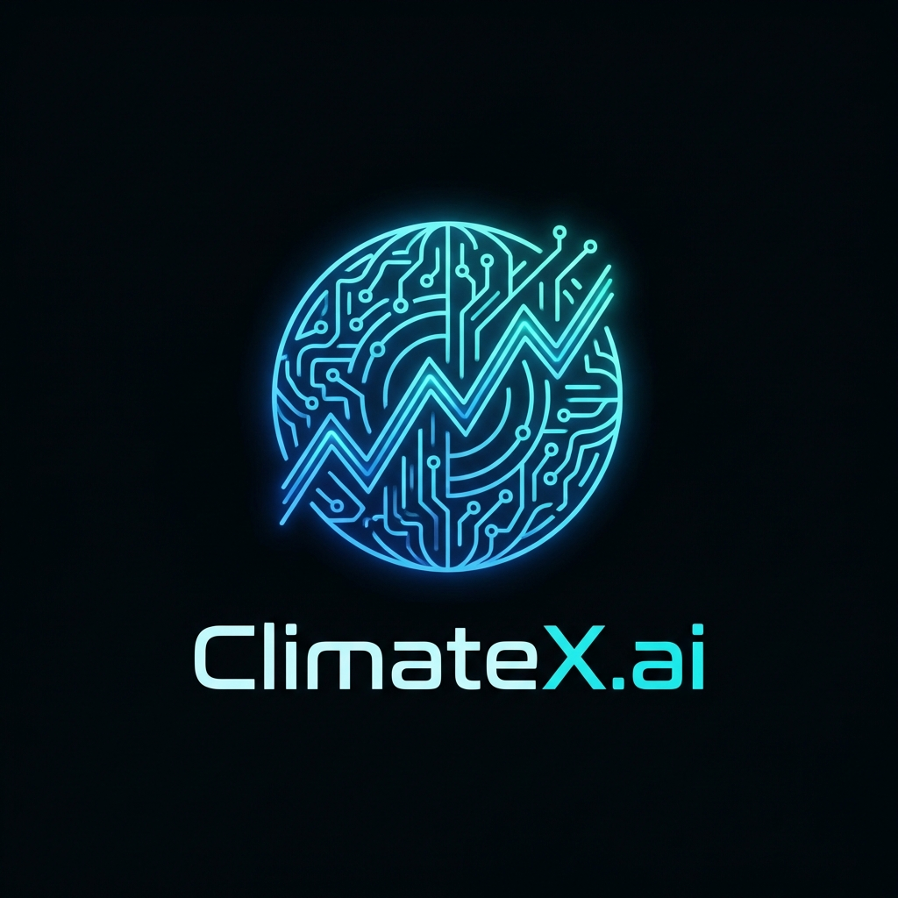
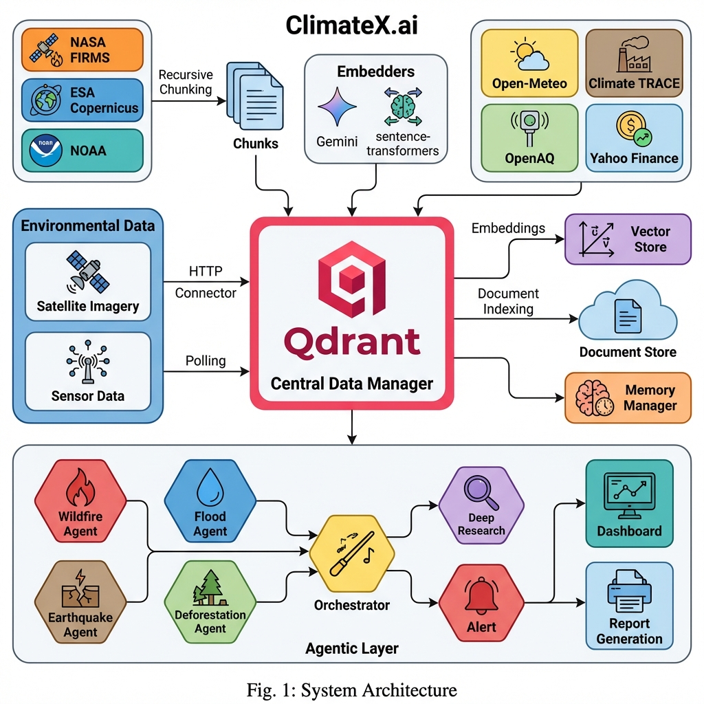
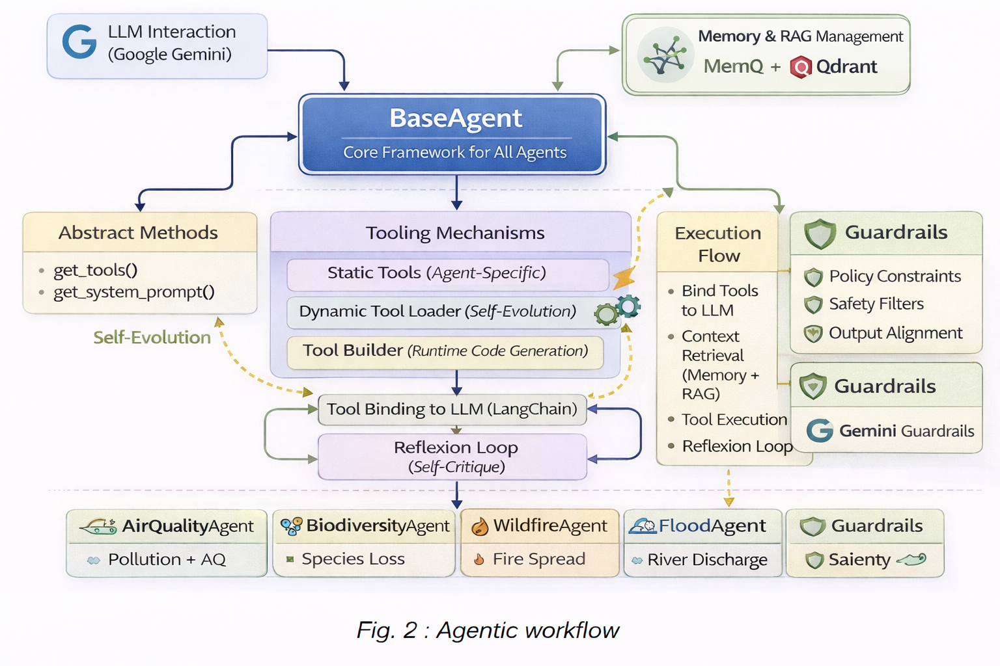
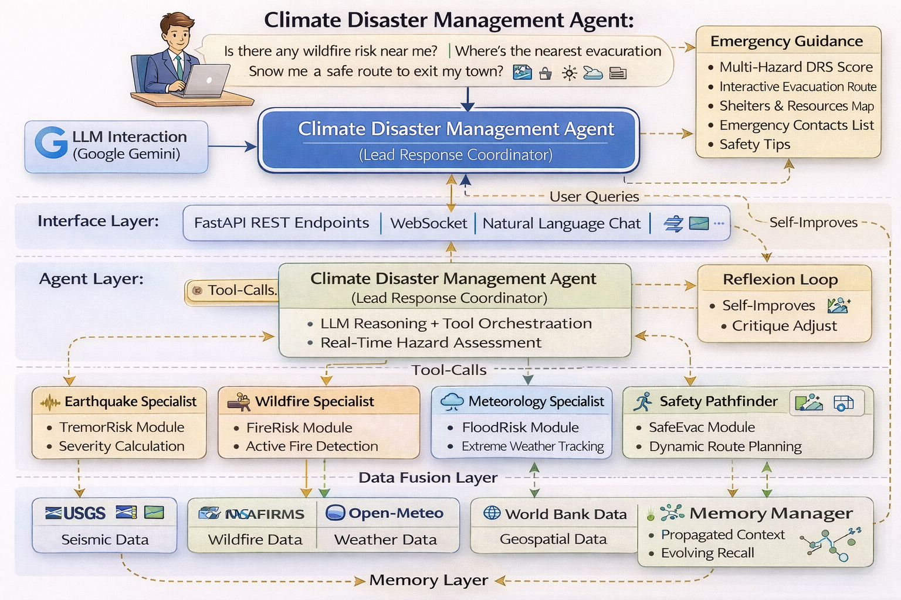
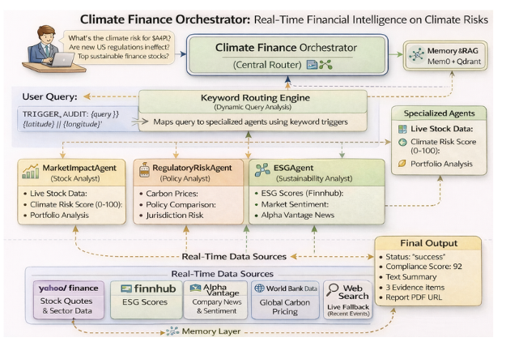
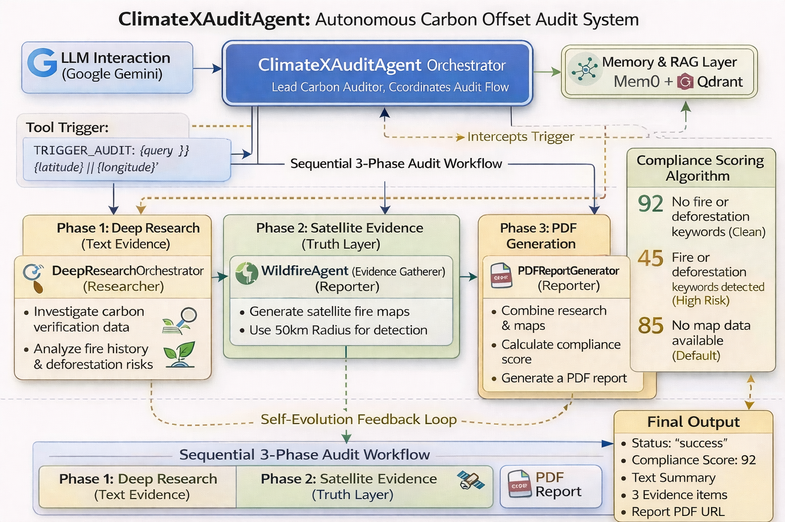
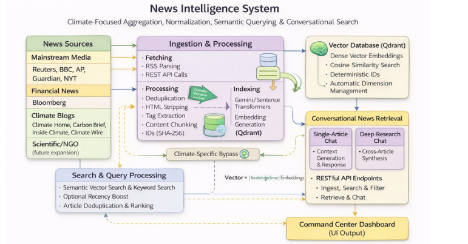
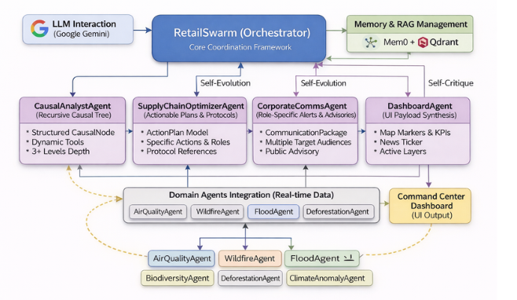
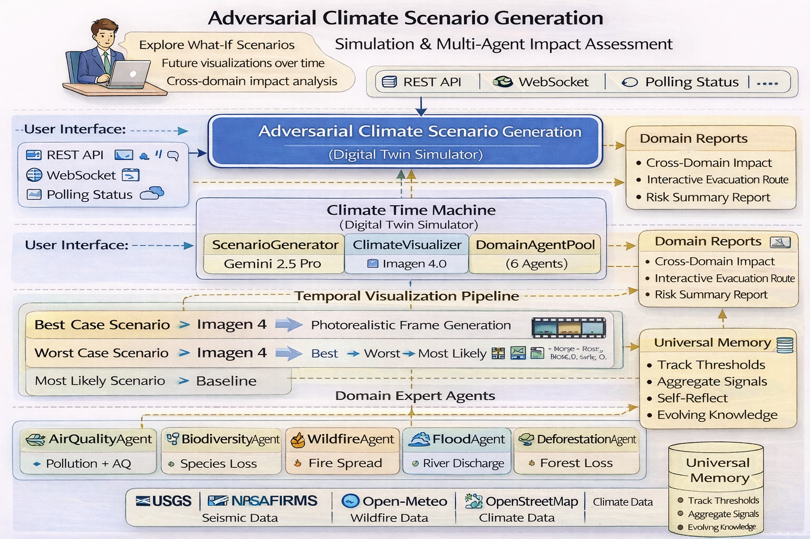
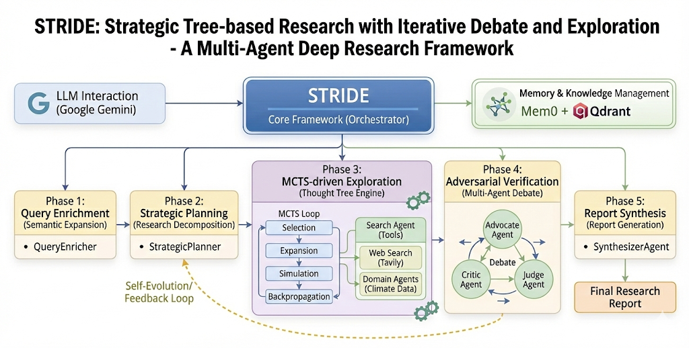

# 🌍 ClimateX.ai - PRAKRITI

<div align="center">
  
  <h3>Planetary Risk Assessment & Knowledge-driven Real-time Intelligence for Threat Monitoring & Impact Analysis</h3>
  <p><strong>The Operating System for Planetary Intelligence</strong></p>
  <p>Powered by Qdrant • Built with FastAPI, LangChain & React • 12 Specialized Agents</p>
</div>

---

## 🎯 Vision

ClimateX.ai is not just a dashboard—it's an **autonomous swarm of AI agents** working 24/7 to decode the complex feedback loops between **Earth's Climate Systems** and **Global Financial Markets**.

---

## 🏗️ System Architecture

<div align="center">
  
</div>

---

## 🚀 Core Capabilities

By integrating satellite data (NASA FIRMS, ESA Copernicus) with financial feeds (Yahoo Finance) and regulatory databases, ClimateX.ai delivers:

| Capability | Description |
|------------|-------------|
| 🔥 **Disaster Intelligence** | Unified monitoring of wildfires, floods, earthquakes from NASA, GDACS, NOAA |
| 🤖 **Ambient Agents** | Autonomous agents detect threats and alert without human queries |
| 📊 **Climate-Finance Nexus** | Real-time correlation of climate events to stock movements |
| 📚 **Deep Research** | AI synthesizes papers, filings, reports into actionable briefs |
| 🗺️ **Evacuation Routing** | Auto-generated safe routes avoiding hazards with shelter mapping |
| 🔮 **Climate Time Machine** | Scenario simulations (+2°C, +3°C) with economic projections |

---

## 🤖 Agent Architecture

### Base Agent Framework
<div align="center">
  
</div>

---

## 🌐 Specialized Agents

### 1. Climate Disaster Management Agent
<div align="center">
  
</div>

- **Role**: Crisis Commander
- Monitors real-time alerts from GDACS, NASA FIRMS, USGS
- Calculates distance and spread speed of hazards
- Locates nearest hospitals and shelters
- Generates safe evacuation routes avoiding the danger zone

---

### 2. Climate Finance Orchestrator
<div align="center">
  
</div>

- **Role**: Financial Analyst
- Tracks stock tickers and correlates volatility with climate events
- ESG scoring with regulatory citations
- Carbon price tracking (EU ETS, California Cap-and-Trade)
- Portfolio climate exposure analysis

---

### 3. ClimateX Audit Agent
<div align="center">
  
</div>

- **Role**: Compliance Officer
- Supply chain climate resilience verification
- TCFD/CSRD compliance monitoring
- Audit trail generation with source citations

---

### 4. News Intelligence Agent
<div align="center">
  
</div>

- **Role**: Information Synthesizer
- Real-time ingestion of climate and market news
- Multi-source data fusion and deduplication
- Sentiment analysis and impact scoring

---

### 5. Retail Analytics Agent
<div align="center">
  
</div>

- **Role**: Supply Chain Optimizer
- Weather-driven demand forecasting
- Inventory optimization based on climate predictions
- Supply chain risk assessment

---

### 6. Adversarial Event Generation (Climate Time Machine)
<div align="center">
  
</div>

- **Role**: Futurist Simulator
- Generates detailed scenarios for +2°C, +3°C warming
- Economic collapse projections and crop failure analysis
- Visual scenario generation with AI imagery

---

### 7. STRIDE Security Framework
<div align="center">
  
</div>

- **Role**: Security Analyst
- Threat modeling for climate infrastructure
- Vulnerability assessment and mitigation strategies

---

## 📊 Key Statistics

| Metric | Value | Source |
|--------|-------|--------|
| ESA satellite data operationalized | < 1% | ESA, 2023 |
| Climate Tech market (2025) | $32B | BloombergNEF |
| Climate Tech market (2034) | $80B+ | BloombergNEF |
| Companies under CSRD/TCFD by 2030 | 50,000+ | EU Commission |
| Institutional investors prioritizing climate data | 83% | PwC, 2024 |

---

## ⚡ Quick Start Guide

### Clone the Repository
```bash
git clone https://github.com/SRINJOY59/Convolve_MAS.git
cd Convolve_MAS
```

### Backend (Brain)
```bash
# 1. Setup Environment
python -m venv venv
source venv/bin/activate  # Windows: venv\Scripts\activate

# 2. Install Requirements
pip install -r requirements.txt

# 3. Launch Nerve Center
uvicorn main:app --reload
# API validates at http://localhost:8000/docs
```

### Frontend (Dashboard)
```bash
cd frontend

# 1. Install Dependencies
npm install

# 2. Launch Interface
npm run dev
# Access Mission Control at http://localhost:5173
```

---

## 🛠️ Technology Stack

| Layer | Technologies |
|-------|--------------|
| **LLM Orchestration** | LangChain, LangGraph |
| **Models** | Gemini 2.0 Flash, Gemini 2.5 Flash |
| **RAG Infrastructure** | Qdrant Vector DB, 5-stage pipeline |
| **Frontend** | React, Vite, Framer Motion, TailwindCSS, Recharts |
| **Backend** | FastAPI, Pydantic |
| **Geospatial** | Mapbox, Leaflet, NASA GIBS |
| **Data Sources** | NASA FIRMS, ESA Copernicus, NOAA, Climate TRACE, GDACS |

---

## 🔬 Data Sources Integration

- **NASA FIRMS** - Active fire detection
- **ESA Copernicus** - Climate data services
- **NOAA** - Weather and ocean monitoring
- **Climate TRACE** - Emissions tracking
- **GDACS** - Global disaster alerts
- **OpenAQ** - Air quality monitoring
- **Yahoo Finance** - Market data feeds
- **USGS** - Earthquake detection

---

## 📝 Conclusion

Climate change is no longer a distant threat—it is a present-day operational risk affecting supply chains, portfolios, and communities. ClimateX.ai was built to meet this moment. By deploying autonomous agents that never sleep, RAG pipelines that cite every source, and a Climate Time Machine that simulates futures, the platform empowers researchers, investors, and crisis responders to act with confidence.

As mandatory climate disclosures reshape corporate accountability and 83% of institutional investors demand better risk data, the need for intelligent, explainable climate infrastructure has never been greater. ClimateX.ai operationalizes what others only visualize—turning the less than 1% of satellite data that reaches decision-makers into actionable intelligence.

The question is no longer whether AI can help solve climate challenges—it's how fast we can deploy it.

**ClimateX.ai: Planetary Intelligence, Real-Time.**

---

<p align="center">
  <strong>Convolve Hackathon 2026 • Making the invisible visible.</strong>
</p>
