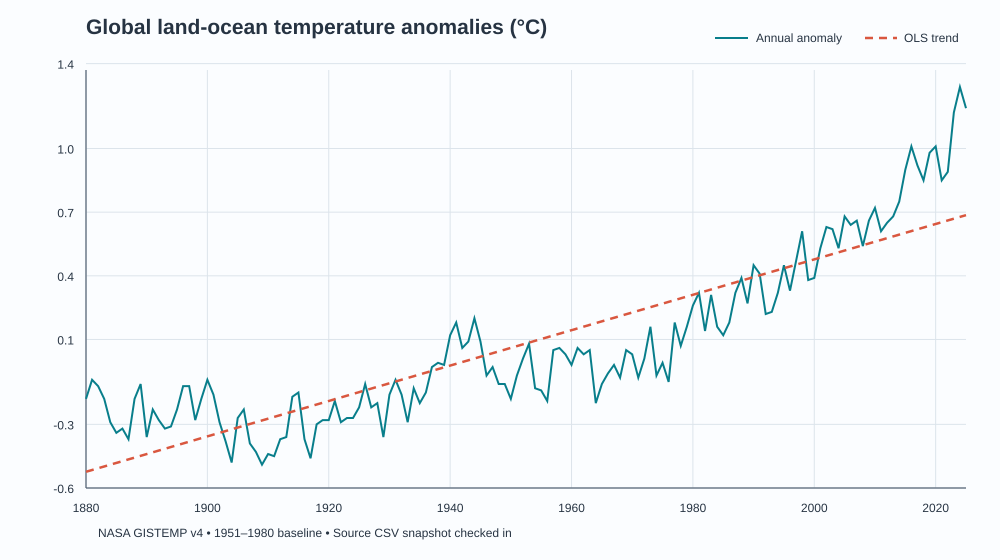

# Climate Crew

Climate Crew is a climate and environmental research prototype. The repository contains climate data connectors, specialist agents, a FastAPI backend, a React frontend, and a multi-agent deep-research pipeline. The broad application is not yet validated as an end-to-end scientific system.

## Implemented, prototype, planned

| Status | Capability | Evidence in this repository |
|---|---|---|
| Implemented and offline-tested | One reproducible climate result: source snapshot → trend statistics → endpoint sensitivity check → uncertainty → report and plot | `analysis/reproduce_gistemp.py`, `src/science/`, `data/science/`, `artifacts/science/` |
| Implemented as typed records | Evidence records with source, retrieval date, evidence type, independence group and derivation links; competing hypotheses; falsification test; uncertainty assessment | `src/science/models.py` |
| Prototype | Climate/environment data adapters, specialist agents, FastAPI routes and React workspace | `src/`, `main.py`, `frontend/` |
| Prototype | Deep-research orchestration with planning, search, debate and synthesis; provider credentials and external services are required | `src/agents/deep_research/` |
| Planned | Durable project-wide evidence graph, independent replication across datasets, and expert validation gates integrated into the application | Not implemented end to end |

The former retail and climate-finance/ESG experiments are preserved under [`examples/`](examples/README.md) and are no longer mounted by the default API or frontend. They are not part of the climate-science portfolio focus.

## Reproduce the climate result

The checked-in input is a pinned snapshot of NASA GISTEMP v4 global land-ocean annual anomalies. The `J-D` column is measured in degrees Celsius relative to 1951–1980. The analysis excludes the incomplete 2026 row and uses complete years 1880–2025.

```bash
python -m pip install -r requirements-science.txt
python analysis/reproduce_gistemp.py
python analysis/reproduce_gistemp.py --check
python -m pytest -q tests/science
```

The script has no network or model-key requirement. It writes a machine-readable report to [`artifacts/science/gistemp_trend_result.json`](artifacts/science/gistemp_trend_result.json) and a plot to [`artifacts/science/gistemp_global_trend.svg`](artifacts/science/gistemp_global_trend.svg). CI checks both outputs against the pinned data and runs the offline tests.

**Result for this snapshot:** 146 annual observations; OLS trend **0.0834 °C/decade** (95% circular 5-year moving-block bootstrap interval **0.0676–0.0980**); Theil–Sen slope **0.0812 °C/decade**; two-sided Mann–Kendall tau-b **0.7347**, *p* = **3.44 × 10⁻³⁹**. The exploratory endpoint check excludes 2016–2025 and still finds a positive 1880–2015 trend (Sen slope 0.0711 °C/decade; Mann–Kendall *p* = 4.37 × 10⁻³³). That check does not overturn the observed trend in this series.



**Limits:** this is a descriptive result from one global dataset, not an independent replication or causal-attribution analysis. The Mann–Kendall p-value uses the normal approximation with tie correction and does not adjust its variance for serial autocorrelation. The block-bootstrap interval uses the stated 5-year residual blocks and does not cover every measurement or structural uncertainty. See the JSON report for methods and caveats.

Source: [NASA GISS GISTEMP v4 data downloads](https://data.giss.nasa.gov/gistemp/data_v4.html). Snapshot retrieved 2026-10-04; SHA-256 is recorded in `data/science/gistemp_manifest.json`.

## Evaluation

`eval/science_quality/` contains 60 balanced, **synthetic controlled evidence scenarios** and a paired comparison harness for the Climate Crew adapter and a single-LLM adapter. It reports relationship accuracy with Wilson 95% intervals, evidence precision/recall/F1, a Brier score, and a paired bootstrap interval for the accuracy difference.

CI uses mocked adapters to test the harness on all 60 cases without network access. Those mocked scores are plumbing checks, not model-performance evidence. To run a real provider comparison, follow [`eval/science_quality/README.md`](eval/science_quality/README.md); start with a small `--limit` because the multi-agent run makes multiple provider calls per case. No real comparative score is claimed until that run is made and its model IDs, date, commit, and cost are published.

The older `eval/` runner remains a prototype: its system integration currently returns mock outputs. Do not treat its results as measured Climate Crew performance.

## Tests and CI boundary

The new workflow runs only the offline scientific slice:

```bash
python -m pytest -q tests/science
python analysis/reproduce_gistemp.py --check
```

The older scripts under `test/` include provider-backed demos and integration checks. They are not all automated by this workflow and may require credentials, services, or network access. Passing the new suite validates the bounded result and benchmark harness, not the complete API, frontend, or all external integrations.

The legacy three-query baseline can also be run with `python -m pytest test/test_eval.py -k offline_baseline`. It verifies the mock-runner plumbing only and is not a model benchmark.

## Run the application prototype

The complete backend and frontend have a larger pinned dependency set and external-service requirements:

```bash
python -m venv .venv
source .venv/bin/activate  # Windows: .venv\\Scripts\\activate
python -m pip install -r requirements.txt
uvicorn main:app --reload
```

The API docs are normally available at `http://localhost:8000/docs`. For the frontend, run `npm install` and `npm run dev` from `frontend/`. Set provider credentials through environment variables when using integrations that require them.

## Provenance and license

The repository history records a migration from `ClimateX.ai-main.zip` on 2026-09-26. The archive is not in the current tree, and the history does not identify an upstream URL or license. [`PROVENANCE.md`](PROVENANCE.md) records this boundary and the NASA data source. Non-core retail and finance experiments are preserved under `examples/`; the historical binary asset bundle can be published with the workflow described in [`docs/release-assets.md`](docs/release-assets.md).

The repository includes an MIT license for original project contributions. Third-party material remains subject to its applicable terms; no unverified upstream attribution is invented.
