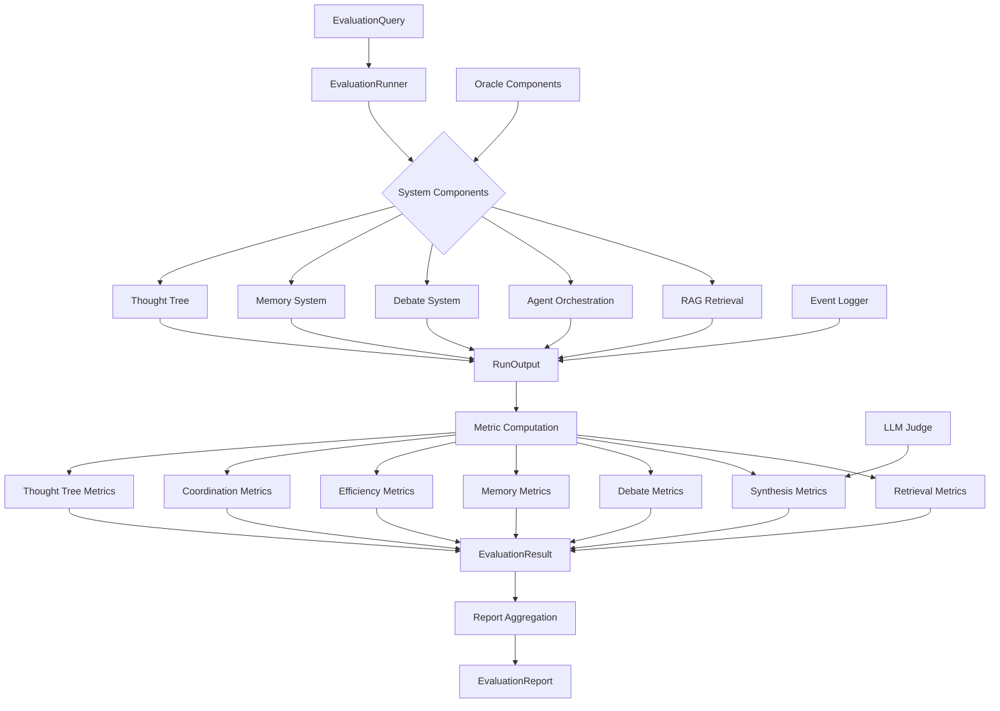
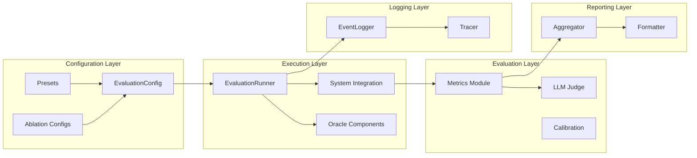

# Evaluation Framework

> **Status:** this general-purpose framework is a prototype. `eval/runner.py` currently produces mock system outputs and does not call the live Climate Crew orchestrator. Its results must not be presented as measured model performance. The bounded, provider-pluggable comparison harness is in [`eval/science_quality/`](science_quality/README.md); its CI adapters are mocks and do not establish a real crew-versus-baseline score.

Comprehensive evaluation framework for multi-agent systems with support for retrieval, synthesis, debate, memory, and thought tree components.

## Overview

The evaluation framework provides systematic assessment of multi-agent system performance across multiple dimensions. It supports configurable system components, oracle-based testing, LLM-based judging, and comprehensive metric computation.

## Architecture

### System Flow



### Component Architecture



## Components

### Core Components

#### EvaluationRunner
Main orchestrator for evaluation runs. Handles:
- Query execution through system integration
- Metric computation coordination
- Result aggregation
- Error handling and retry logic

#### EvaluationConfig
Configuration management with:
- Component toggles (RAG, debate, memory, thought tree)
- Agent enable/disable flags
- Oracle mode selection
- LLM judge settings
- Output and logging configuration

#### Types
Type definitions for:
- `EvaluationQuery`: Input query with ground truth
- `RunOutput`: Complete system output with traces
- `EvaluationResult`: Query result with metrics
- `EvaluationReport`: Aggregated report across queries

### Metrics Module

#### Retrieval Metrics
- Precision@k, Recall@k
- Mean Reciprocal Rank (MRR)
- Normalized Discounted Cumulative Gain (NDCG@k)
- Answerability@k

#### Synthesis Metrics
- LLM judge absolute scoring
- Ground truth comparison
- Completeness assessment

#### Debate Metrics
- Consensus rate
- Round efficiency
- Argument quality

#### Memory Metrics
- Retrieval accuracy
- Storage efficiency
- Context relevance

#### Efficiency Metrics
- Latency (ms)
- Token usage
- Cost (USD)
- Throughput

#### Coordination Metrics
- Agent coordination efficiency
- Task distribution
- Resource utilization

#### Thought Tree Metrics
- Tree depth and breadth
- Node visit distribution
- Value convergence

### Oracle Components

Oracle components provide perfect ground truth behavior for ablation studies:

- **OracleRetrieval**: Returns perfect retrieval results based on ground truth documents
- **OraclePlanner**: Provides optimal planning decisions
- **OracleMemory**: Returns ideal memory operations

### LLM Judge

LLM-based evaluation for synthesis quality:
- Pairwise comparison between answers
- Absolute scoring on 0-1 scale
- Blind evaluation mode (hides agent names)
- Configurable model selection

### Logging and Tracing

- **EventLogger**: Logs complete run traces to JSON
- **Tracer**: Captures agent execution traces in real-time

### Reporting

- **Aggregator**: Computes aggregate statistics across runs
- **Formatter**: Formats reports as JSON and Markdown
- Supports per-difficulty breakdowns
- Cost and failure mode analysis

## Rationale

### Design Decisions

#### Modular Metric System
Metrics are separated into independent modules to enable:
- Selective metric computation based on enabled components
- Easy addition of new metrics
- Component-specific evaluation without dependencies

#### Oracle Components
Oracle components serve multiple purposes:
- Ablation studies: Isolate component impact by replacing real components with perfect versions
- Upper bound estimation: Measure maximum achievable performance
- Debugging: Identify if failures are component-specific or systemic

#### Configuration Presets
Preset configurations enable:
- Reproducible evaluation runs
- Standard ablation study configurations
- Quick comparison between system variants

#### LLM Judge Integration
LLM-based judging provides:
- Flexible evaluation criteria that adapt to query type
- Nuanced assessment beyond exact match metrics
- Scalable evaluation without manual annotation

#### Comprehensive Tracing
Detailed tracing supports:
- Debugging system failures
- Understanding agent behavior
- Performance bottleneck identification
- Reproducibility of results

#### Type-Safe Data Structures
Strict typing ensures:
- Clear data contracts between components
- Early error detection
- Self-documenting code
- IDE support and autocomplete

## Usage

### Basic Evaluation

```python
from eval.runner import run_evaluation

report = run_evaluation(
    config="full",
    dataset="eval/data/benchmark.json",
    output_dir="eval/outputs"
)
```

### Custom Configuration

```python
from eval.config import EvaluationConfig
from eval.runner import EvaluationRunner

config = EvaluationConfig(
    enable_rag=True,
    enable_debate=False,
    enable_memory=True,
    enable_thought_tree=False,
    config_name="custom"
)

runner = EvaluationRunner(config)
result = runner.run_single(query)
```

### Ablation Studies

```python
from eval.ablations.configs import get_ablation_configs

configs = get_ablation_configs()
for config in configs:
    runner = EvaluationRunner(config)
    results = runner.run_batch(queries)
    # Compare results across configurations
```

### Oracle Mode

```python
ground_truth_docs = {
    "doc1": "Content about topic A",
    "doc2": "Content about topic B"
}

config = EvaluationConfig(
    use_oracle_retrieval=True,
    config_name="oracle_retrieval"
)

runner = EvaluationRunner(config)
result = runner.run_single(query, ground_truth_docs=ground_truth_docs)
```

## Configuration Options

### System Toggles
- `enable_rag`: Enable retrieval-augmented generation
- `enable_debate`: Enable debate system
- `enable_memory`: Enable memory system
- `enable_multihop`: Enable multi-hop reasoning
- `enable_thought_tree`: Enable thought tree (MCTS) planning

### Agent Configuration
- `agents_enabled`: Dict mapping agent names to enabled status
  - `search_agent`: Web search agent
  - `strategic_planner`: Strategic planning agent
  - `synthesizer`: Answer synthesis agent
  - `query_enricher`: Query enrichment agent

### RAG Settings
- `rag_limit`: Maximum number of retrieved documents
- `rag_use_reranker`: Enable reranking of retrieved documents
- `rag_max_hops`: Maximum retrieval hops for multi-hop queries

### Debate Settings
- `max_debate_rounds`: Maximum debate rounds before timeout

### Thought Tree Settings
- `thought_tree_iterations`: Number of MCTS iterations
- `thought_tree_max_depth`: Maximum tree depth

### LLM Judge Settings
- `use_llm_judge`: Enable LLM-based judging
- `llm_judge_model`: Model name for judge (default: "gemini-1.5-pro")
- `blind_evaluation`: Hide agent names from judge

### Output Settings
- `output_dir`: Directory for output files
- `save_traces`: Save execution traces
- `save_metrics`: Save metric results

## Dataset Format

Evaluation datasets are JSON files with the following structure:

```json
[
  {
    "query": "Query text",
    "expected_topics": ["topic1", "topic2"],
    "ground_truth_answer": "Expected answer",
    "difficulty": "simple|moderate|complex",
    "requires_multihop": false,
    "requires_debate": false,
    "requires_memory": false,
    "metadata": {}
  }
]
```

## Output Format

### EvaluationReport

```python
@dataclass
class EvaluationReport:
    config_name: str
    total_queries: int
    successful_runs: int
    failed_runs: int
    aggregate_metrics: List[AggregateMetrics]
    per_query_results: List[EvaluationResult]
    cost_summary: Dict[str, Any]
    failure_modes: List[Dict[str, Any]]
    timestamp: datetime
```

### AggregateMetrics

```python
@dataclass
class AggregateMetrics:
    metric_name: str
    mean: float
    std: float
    min: float
    max: float
    median: float
    count: int
    per_difficulty: Dict[str, float]
    metadata: Dict[str, Any]
```

## Integration Points

### System Integration

The `_run_system` method in `EvaluationRunner` is a placeholder that should be replaced with actual system integration. It should:

1. Initialize the orchestrator with the evaluation config
2. Execute the query through the system
3. Capture all outputs, traces, and metadata
4. Return a `RunOutput` object

### Custom Metrics

To add custom metrics:

1. Create a new module in `eval/metrics/`
2. Implement a `compute` function that takes `run_output` and `ground_truth` dicts
3. Return a dict mapping metric names to `MetricResult` objects
4. Add the import to `eval/metrics/__init__.py`
5. Add metric computation call in `EvaluationRunner._compute_metrics`

## Dependencies

- Python 3.8+
- langchain (for LLM judge)
- langchain-google-genai (for Gemini models)

## File Structure

```
eval/
├── __init__.py
├── config.py              # Configuration management
├── types.py               # Type definitions
├── dataset.py            # Dataset loading
├── runner.py             # Main evaluation runner
├── ablations/
│   └── configs.py        # Ablation study configs
├── judges/
│   ├── llm_judge.py     # LLM-based judging
│   └── calibration.py   # Judge calibration
├── metrics/
│   ├── retrieval.py     # Retrieval metrics
│   ├── synthesis.py     # Synthesis metrics
│   ├── debate.py        # Debate metrics
│   ├── memory.py        # Memory metrics
│   ├── efficiency.py    # Efficiency metrics
│   ├── coordination.py  # Coordination metrics
│   └── thought_tree.py  # Thought tree metrics
├── oracles/
│   ├── oracle_retrieval.py
│   ├── oracle_planner.py
│   └── oracle_memory.py
├── logging/
│   ├── event_logger.py  # Event logging
│   └── tracer.py        # Execution tracing
├── reports/
│   ├── aggregator.py    # Metric aggregation
│   └── formatter.py     # Report formatting
└── data/
    └── benchmark.json   # Evaluation dataset
```
