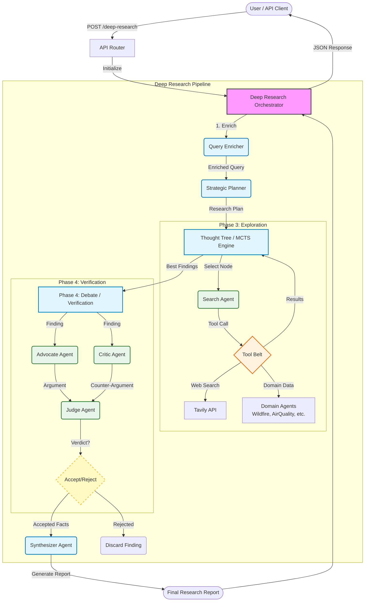

# Deep Research Framework

This module implements an advanced, autonomous research system capable of performing deep, multi-step investigations into complex topics. It combines Monte Carlo Tree Search (MCTS), Multi-Agent Debate, and Domain-Specific Tools to generate high-quality, verified research reports.

## Architecture Overview



The Deep Research Framework operates as a pipeline of specialized agents, coordinated by the `DeepResearchOrchestrator`.

### 1. The Pipeline

1.  **Enrichment (`QueryEnricher`)**:
    -   Analyzes the user's raw query.
    -   Expands it with related concepts, clarifies ambiguities, and identifies necessary context.

2.  **Strategic Planning (`StrategicPlanner`)**:
    -   Decomposes the enriched query into a structured research plan.
    -   Identifies key "Research Directions" or sub-questions to investigate.

3.  **Exploration & Search (`ThoughtTree` + `SearchAgent`)**:
    -   Uses **Monte Carlo Tree Search (MCTS)** to navigate the information space.
    -   Nodes in the tree represent research states/findings.
    -   **`SearchAgent`** acts as the interface to the world, equipped with:
        -   **Web Search**: (Tavily API) for general information.
        -   **Domain Agents**: (Air Quality, Wildfire, Earthquake, etc.) used as *tools* to fetch real-time, ground-truth data.

4.  **Verification (`Debate Team`)**:
    -   Findings from MCTS are subjected to adversarial review to reduce hallucinations and verify logic.
    -   **`AdvocateAgent`**: Argues *for* the validity and importance of a finding.
    -   **`CriticAgent`**: Scrutinizes the finding, checking for bias, gaps, or lack of evidence.
    -   **`JudgeAgent`**: Evaluates the debate and renders a verdict (`ACCEPT` or `REJECT`).

5.  **Synthesis (`SynthesizerAgent`)**:
    -   Aggregates all verified facts.
    -   Structuring the final report (Executive Summary, Key Findings, Detailed Analysis).
    -   **Citations**: Ensures every claim is backed by a specific URL reference.

### 2. Key Components

| Component | File | Description |
| :--- | :--- | :--- |
| **Orchestrator** | `orchestrator.py` | The main controller class `DeepResearchOrchestrator` that drives the workflow. |
| **API Router** | `router.py` | A FastAPI router providing the HTTP endpoint (`POST /deep-research`). Handles independent initialization. |
| **MCTS Engine** | `thought_tree.py` | Implements the loop of Selection, Expansion, Simulation, and Backpropagation for research. |
| **Search Tool** | `search_agent.py` | Wraps web search and other agents into a unified tool interface for the MCTS loop. |
| **Debate Agents** | `debate/` | Contains the `Advocate`, `Critic`, and `Judge` agents for the verification phase. |

## Usage

### As a Library
You can use the orchestrator directly in Python code (conceptually):

```python
from src.agents.deep_research import DeepResearchOrchestrator

# Initialize with dependencies
orchestrator = DeepResearchOrchestrator(
    google_api_key="...",
    domain_agents=[...] # Optional list of other agents to use as tools
)

report = orchestrator.run_deep_research("Investigate the impact of...")
```

### Via API Endpoint
The module is exposed via a FastAPI router in `router.py`.

**Endpoint:** `POST /deep-research/`

**Payload:**
```json
{
  "query": "Investigate the impact of recent wildfires in California on air quality."
}
```

**Response:**
```json
{
  "report": "# Deep Research Report\n\n## Executive Summary..."
}
```

## Dependencies

-   **Google Gemini (via LangChain)**: The core LLM powering all agents.
-   **Tavily API**: For high-quality web search results.
-   **NASA FIRMS**: (Optional) For real-time wildfire data via the `WildfireAgent`.
