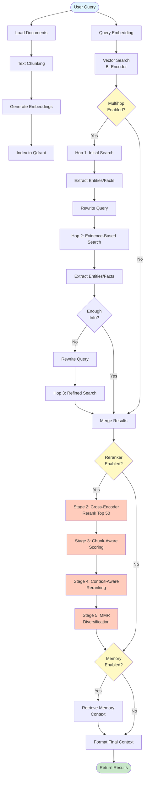

# RAG (Retrieval-Augmented Generation) System

A sophisticated RAG implementation featuring advanced reranking, multihop reasoning, memory integration, and intelligent document processing.

## Key Features & Novelties

### 1. **5-Stage Comprehensive Reranking Pipeline**

Unlike traditional single-stage reranking, our system employs a sophisticated multi-stage pipeline that progressively refines search results:

- **Stage 1: Bi-Encoder (Recall)** - Initial vector similarity search using embeddings
- **Stage 2: Cross-Encoder Reranking** - Deep relevance scoring on top 50 candidates using cross-encoder models
- **Stage 3: Chunk-Aware Scoring** - Considers chunk position, completeness, and metadata quality (titles, headings, sections)
- **Stage 4: Context-Aware Reranking** - Document-level context analysis and query-term density scoring
- **Stage 5: MMR Diversification** - Maximal Marginal Relevance algorithm to balance relevance and diversity, avoiding redundant results

This pipeline ensures both high precision and recall, with results that are both relevant and diverse.

### 2. **True Multihop Reasoning**

Advanced iterative reasoning that breaks down complex queries into multiple search hops:

- **Iterative Query Decomposition** - Automatically decomposes complex queries
- **Entity & Fact Extraction** - Extracts key entities and facts from retrieved documents using LLM
- **Evidence-Based Query Rewriting** - Rewrites queries using extracted evidence for subsequent hops
- **Adaptive Stopping** - Intelligently determines when sufficient information has been gathered
- **Deduplication** - Prevents redundant document retrieval across hops

This enables answering complex questions that require information from multiple sources or reasoning steps.

### 3. **Memory Integration (Mem0)**

Seamless integration with persistent memory:

- **Context Enhancement** - Augments RAG results with relevant historical context
- **Cross-Session Persistence** - Maintains context across different sessions
- **Agent-Specific Memory** - Supports multiple agents with isolated memory spaces

### 4. **Dual Embedding System with Intelligent Fallback**

Robust embedding generation with automatic failover:

- **Primary: Google Gemini Embeddings** - High-quality embeddings using `gemini-embedding-001`
- **Fallback: Sentence-Transformers** - Automatic fallback to `all-MiniLM-L6-v2` on API failures
- **Task-Specific Embeddings** - Different embeddings for documents (`RETRIEVAL_DOCUMENT`) vs queries (`RETRIEVAL_QUERY`)
- **Quota Management** - Automatically switches to fallback on quota exhaustion
- **Dimension Auto-Detection** - Automatically detects and adapts to embedding dimensions

### 5. **Semantic Chunking**

Intelligent text chunking strategies:

- **Fixed-Size Chunking** - Traditional chunking with configurable size and overlap
- **Semantic Chunking** - Groups sentences by semantic similarity for more coherent chunks
- **Smart Separators** - Prefers natural break points (paragraphs, sentences, words)
- **Overlap Handling** - Maintains context across chunk boundaries

### 6. **Comprehensive Document Processing**

Multi-format document support:

- **Format Support** - PDF, TXT, Markdown files
- **Recursive Loading** - Loads entire directory structures
- **Metadata Extraction** - Preserves document metadata (titles, authors, page numbers)
- **Batch Processing** - Efficient batch embedding and indexing

### 7. **Vector Database Integration**

Production-ready vector storage:

- **Qdrant Integration** - High-performance vector database
- **Automatic Collection Management** - Creates and manages collections automatically
- **Dimension Validation** - Ensures collection dimensions match embedding dimensions
- **Deterministic IDs** - Uses SHA256 hashing for consistent document IDs

## System Flow Diagram

### Mermaid Diagram (Interactive)



### ASCII Flow Diagram

```
┌─────────────────────────────────────────────────────────────────┐
│                        INDEXING FLOW                             │
└─────────────────────────────────────────────────────────────────┘

Documents → DocumentLoader → TextChunker → Embeddings → Qdrant
   ↓              ↓              ↓            ↓           ↓
PDF/TXT/MD    Extract Text   Fixed/Semantic  Gemini/     Vector
              + Metadata      Chunking        Fallback    Storage


┌─────────────────────────────────────────────────────────────────┐
│                        RETRIEVAL FLOW                            │
└─────────────────────────────────────────────────────────────────┘

User Query
    │
    ├─→ Query Embedding (RETRIEVAL_QUERY task)
    │
    ├─→ Vector Search (Bi-Encoder) → Top 50-100 candidates
    │
    ├─→ [Multihop?] ──┐
    │                 │
    │                 ├─→ YES: Multihop Reasoning
    │                 │         │
    │                 │         ├─→ Hop 1: Initial Search
    │                 │         │         │
    │                 │         ├─→ Extract Entities/Facts (LLM)
    │                 │         │         │
    │                 │         ├─→ Rewrite Query with Evidence
    │                 │         │         │
    │                 │         ├─→ Hop 2: Evidence-Based Search
    │                 │         │         │
    │                 │         ├─→ Extract Entities/Facts
    │                 │         │         │
    │                 │         ├─→ Should Continue? (LLM Decision)
    │                 │         │         │
    │                 │         ├─→ [Continue] → Hop 3: Refined Search
    │                 │         │
    │                 │         └─→ [Stop] → Merge All Results
    │                 │
    │                 └─→ NO: Direct to Reranking
    │
    ├─→ [Reranker?] ──┐
    │                 │
    │                 ├─→ YES: 5-Stage Reranking Pipeline
    │                 │         │
    │                 │         ├─→ Stage 2: Cross-Encoder Reranking (Top 50)
    │                 │         │         │
    │                 │         ├─→ Stage 3: Chunk-Aware Scoring
    │                 │         │         │
    │                 │         ├─→ Stage 4: Context-Aware Reranking
    │                 │         │         │
    │                 │         └─→ Stage 5: MMR Diversification
    │                 │
    │                 └─→ NO: Direct to Memory
    │
    ├─→ [Memory?] ──┐
    │               │
    │               ├─→ YES: Retrieve Memory Context (Mem0)
    │               │
    │               └─→ NO: Skip Memory
    │
    └─→ Format Final Context → Return Results


┌─────────────────────────────────────────────────────────────────┐
│                    MULTIHOP REASONING DETAIL                    │
└─────────────────────────────────────────────────────────────────┘

Query: "What are the impacts of climate change on biodiversity?"

Hop 1:
  Query → Vector Search → Results
  Results → Extract: ["climate change", "biodiversity", "ecosystems"]
  
Hop 2:
  Rewritten Query: "climate change biodiversity ecosystems ocean temperature"
  Query → Vector Search → Results
  Results → Extract: ["ocean acidification", "coral reefs", "species extinction"]
  
Hop 3:
  Rewritten Query: "ocean acidification coral reefs species extinction impacts"
  Query → Vector Search → Results
  
Final: Merge all results → Rerank → Return top K
```

## Detailed Component Flow

### Indexing Flow

```
Documents → DocumentLoader → TextChunker → Embeddings → Qdrant
   ↓              ↓              ↓            ↓           ↓
PDF/TXT/MD    Extract Text   Fixed/Semantic  Gemini/     Vector
              + Metadata      Chunking        Fallback    Storage
```

### Retrieval Flow (Single Query)

```
Query → Embedding → Vector Search → Reranking Pipeline → Memory → Context
  ↓         ↓            ↓              ↓                  ↓        ↓
User    RETRIEVAL_   Bi-Encoder   5-Stage Pipeline    Mem0    Formatted
Query   QUERY task   (Top 50-100)  (Cross-Encoder →   Context  Results
                                    Chunk-Aware →
                                    Context-Aware →
                                    MMR)
```

### Multihop Reasoning Flow

```
Query → Hop 1 Search → Extract Entities/Facts → Rewrite Query
  ↓           ↓                  ↓                      ↓
Original   Initial Results    LLM Extraction      Enhanced Query
Query      (Top K docs)       (Key Info)           (with Evidence)
                                                      ↓
                                            Hop 2 Search → Extract → ...
                                                      ↓
                                            Continue until sufficient
                                                      ↓
                                            Final Merge & Rerank
```

##  Usage Example

```python
from src.rag import RAGManager, DocumentLoader, TextChunker

# Initialize RAG Manager with all features
rag_manager = RAGManager(
    enable_memory=True,      # Enable Mem0 integration
    use_reranker=True,       # Enable 5-stage reranking
    enable_multihop=True,    # Enable multihop reasoning
    max_hops=3               # Maximum reasoning hops
)

# Load and index documents
loader = DocumentLoader()
documents = loader.load_directory("docs", recursive=True)

chunker = TextChunker(
    chunk_size=100000,
    chunk_overlap=2000,
    use_semantic_chunking=True  # Optional semantic chunking
)
chunks = chunker.chunk_documents(documents)

rag_manager.index_documents(chunks, batch_size=128)

# Search with all features
results = rag_manager.search(
    query="What are the impacts of climate change on biodiversity?",
    limit=5,
    use_multihop=True,   # Use multihop reasoning
    use_reranker=True    # Use comprehensive reranking
)

# Get formatted context (includes memory)
context = rag_manager.get_context(
    query="climate change",
    limit=3,
    include_memory=True
)
```

## Performance Characteristics

### Reranking Pipeline
- **Recall**: Bi-encoder retrieves top 50-100 candidates
- **Precision**: 5-stage pipeline refines to top K results
- **Diversity**: MMR ensures non-redundant results
- **Latency**: ~200-500ms per query (depending on reranking stages)

### Multihop Reasoning
- **Complexity Handling**: Can handle queries requiring 2-3 reasoning steps
- **Adaptive**: Stops early when sufficient information is found
- **Deduplication**: Prevents redundant document retrieval
- **Latency**: ~1-3 seconds per hop (depends on LLM response time)

### Embedding System
- **Primary**: Gemini embeddings (3072 dimensions, high quality)
- **Fallback**: Sentence-transformers (768 dimensions, fast)
- **Automatic Failover**: Seamless transition on API issues
- **Batch Processing**: Efficient batch embedding generation

## 🔧 Configuration

### Environment Variables

```bash
# Required
QDRANT_URL=your_qdrant_url
QDRANT_API_KEY=your_qdrant_api_key
GOOGLE_API_KEY=your_google_api_key  # Optional if using fallback embeddings
```

### RAG Manager Options

```python
RAGManager(
    # Vector Database
    qdrant_url="...",
    qdrant_api_key="...",
    collection_name="convolve_mas_documents",
    
    # Embeddings
    embedding_model="gemini-embedding-001",
    use_fallback_embeddings=True,
    fallback_model="all-MiniLM-L6-v2",
    
    # Features
    enable_memory=True,
    use_reranker=True,
    reranker_model="cross-encoder/ms-marco-MiniLM-L-6-v2",
    enable_multihop=True,
    max_hops=3
)
```

##  When to Use Each Feature

### Use Multihop Reasoning When:
- Query requires information from multiple sources
- Query has multiple sub-questions
- Initial search returns insufficient results
- Complex reasoning is needed

### Use Reranking When:
- You need high-precision results
- Initial vector search returns many candidates
- Query is ambiguous or requires nuanced matching
- You want diverse, non-redundant results

### Use Memory When:
- You want context from previous conversations
- Building conversational systems
- Need persistent context across sessions
- Agent-specific memory is required

### Use Semantic Chunking When:
- Documents have clear semantic boundaries
- You want more coherent chunks
- Fixed-size chunking breaks important context
- Documents are well-structured

##  Architecture Decisions

1. **5-Stage Reranking**: Balances precision and diversity through progressive refinement
2. **Multihop with LLM Extraction**: Uses LLM for entity extraction rather than simple keyword matching
3. **Dual Embedding System**: Ensures reliability with automatic fallback
4. **Task-Specific Embeddings**: Uses different embeddings for documents vs queries (Gemini feature)
5. **MMR at Final Stage**: Ensures diversity after all relevance scoring
6. **Adaptive Multihop Stopping**: Prevents unnecessary hops when information is sufficient

##  Technical Details

### Embedding Dimensions
- **Gemini**: 3072 dimensions (default)
- **Fallback**: 768 dimensions (sentence-transformers)
- System automatically detects and adapts

### Reranking Weights
- **Stage 2**: 20% bi-encoder + 80% cross-encoder
- **Stage 3**: Applies chunk-aware multipliers (0.9-1.15x)
- **Stage 4**: Applies context-aware multipliers (0.95-1.1x)
- **Stage 5**: MMR with λ=0.7 (70% relevance, 30% diversity)

### Multihop Parameters
- **Max Hops**: Configurable (default: 3)
- **Results per Hop**: 2x limit (to account for deduplication)
- **Stopping Criteria**: LLM-based decision + minimum result threshold

##  Testing

Run the comprehensive test suite:

```bash
python test/test_rag.py
```

Tests cover:
- Document loading
- Text chunking (fixed-size and semantic)
- RAG indexing
- Basic search
- Reranker functionality
- Multihop reasoning
- Memory integration

##  Dependencies

- `qdrant-client`: Vector database client
- `google-genai`: Google Gemini API client
- `sentence-transformers`: Embeddings and reranking models
- `pypdf`: PDF document processing
- `numpy`: Numerical operations

##  Integration

The RAG system integrates seamlessly with:
- **BaseAgent**: All agents can use RAG for document retrieval
- **MemoryManager**: Shared memory context across agents
- **PromptLoader**: YAML-based prompt management for multihop reasoning

##  Future Enhancements

- [ ] Hybrid search (keyword + vector)
- [ ] Query expansion techniques
- [ ] Advanced chunking strategies (hierarchical, topic-based)
- [ ] Result caching for common queries
- [ ] Streaming search results
- [ ] Multi-modal document support (images, tables)
